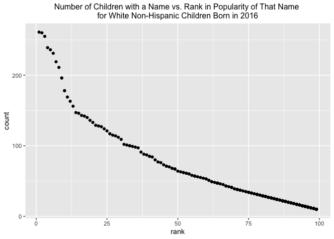

p8105\_hw2\_jdr2191
================
Jess Rosenberg

## Problem 1

Load the tidyverse and readxl

Import excel file

``` r
mrtrashwheel_df = read_excel("Trash-Wheel-Collection-Totals-8-6-19.xlsx", sheet = "Mr. Trash Wheel",
                             range = cell_cols("A:N")) %>%
                  janitor::clean_names() %>%
                  filter(dumpster != "NA") %>%
                  mutate(sports_balls = round(sports_balls, 0))

view(mrtrashwheel_df)
```

Read and clean the precipitation data for 2018 and 2019.

``` r
precipitation18_df = read_excel("Trash-Wheel-Collection-Totals-8-6-19.xlsx",sheet = "2018 Precipitation",
                     range = "A2:B14") %>%
                     janitor::clean_names() %>%
                     mutate(year = "2018")

view(precipitation18_df)

precipitation19_df = read_excel("Trash-Wheel-Collection-Totals-8-6-19.xlsx",sheet = "2019 Precipitation",
                     range = "A2:B14") %>%
                     janitor::clean_names() %>%
                     na.omit %>%
                     mutate(year = "2019") 

view(precipitation19_df)
```

Combine preciptation datasets for 2018 and 2019.

``` r
precipitation_df = bind_rows(precipitation18_df, precipitation19_df) %>%
                   janitor::clean_names() %>%
                   mutate(month = month.name[as.numeric(month)])

view(precipitation_df)
```

The Mr. Trash Wheel dataset contains 344 observations. In 2019, the
median number of sports balls in a dumpster was 8.5 balls. The Mr. Trash
Wheel dataset describes the types of trash Mr. Trash Wheel collects,
including,
`plastic bottles, polystyrene, cigarette butts, glass bottles, grocery bags, chip bags, and sports balls`.
The dataset also provides information about the `date` the trash was
collected, as well as its `weight` and `volume`.

The precipitation dataset contains 18 observations. In 2018, the total
precipitation was 70.33 inches. The precipitation dataset includes a
`month` and `year` variable as well as a total `precipitation` variable.

## Problem 2

Import and clean the data in pols-month.csv.

``` r
pols_month_df = read_csv("pols-month.csv") %>%
                janitor::clean_names() %>%
                separate(mon, sep = "-", into = c("year","month","day"), convert = TRUE) %>%
                mutate(month = month.name[as.numeric(month)]) %>%
                mutate(president = factor(prez_dem, labels = c("gop","dem"))) %>%
                subset(select = -c(prez_dem, prez_gop, day))
```

    ## Rows: 822 Columns: 9

    ## ── Column specification ────────────────────────────────────────────────────────
    ## Delimiter: ","
    ## dbl  (8): prez_gop, gov_gop, sen_gop, rep_gop, prez_dem, gov_dem, sen_dem, r...
    ## date (1): mon

    ## 
    ## ℹ Use `spec()` to retrieve the full column specification for this data.
    ## ℹ Specify the column types or set `show_col_types = FALSE` to quiet this message.

``` r
view(pols_month_df)
```

Import and clean the data in snp.csv.

``` r
snp_df = read_csv("snp.csv") %>%
         janitor::clean_names() %>%
         separate(date, sep = "/", into = c("month","day","year"), convert = TRUE) %>%
         mutate(year = ifelse(year >= 50, year + 1900, year + 2000)) %>%
         mutate(month = month.name[as.numeric(month)]) %>%
         subset(select = -c(day)) %>%
         relocate(year, before = NULL) 
```

    ## Rows: 787 Columns: 2

    ## ── Column specification ────────────────────────────────────────────────────────
    ## Delimiter: ","
    ## chr (1): date
    ## dbl (1): close

    ## 
    ## ℹ Use `spec()` to retrieve the full column specification for this data.
    ## ℹ Specify the column types or set `show_col_types = FALSE` to quiet this message.

``` r
view(snp_df)
```

Import and Clean the Unemployment Data.

``` r
unemployment_df = read_csv("unemployment.csv")
```

    ## Rows: 68 Columns: 13

    ## ── Column specification ────────────────────────────────────────────────────────
    ## Delimiter: ","
    ## dbl (13): Year, Jan, Feb, Mar, Apr, May, Jun, Jul, Aug, Sep, Oct, Nov, Dec

    ## 
    ## ℹ Use `spec()` to retrieve the full column specification for this data.
    ## ℹ Specify the column types or set `show_col_types = FALSE` to quiet this message.

``` r
view(unemployment_df)
```

``` r
unemployment_tidy_df = 
             unemployment_df %>%
             pivot_longer(Jan:Dec,
                          names_to = "month",
                          values_to = "unemployment") %>%
            mutate(month = match(month, month.abb)) %>%
            mutate(month = month.name[as.numeric(month)]) %>%
            janitor::clean_names()

view(unemployment_tidy_df)
```

Merge snp into pols.

``` r
snp_pols_df =
  left_join(pols_month_df, snp_df, by = c("month","year"))

view(snp_pols_df)
```

Merge unemployment\_tidy\_df into snp\_pols\_df

``` r
snp_pols_unemployment_df =
  left_join(snp_pols_df, unemployment_tidy_df, by = c("month","year"))

view(unemployment_tidy_df)
view(snp_pols_unemployment_df)
```

The pols\_month dataset contains year and month of the count, a variable
indicating whether the President was a Democrat or a Republican on the
associated date, variables indicating the number of Republican and
Democratic Governors on the associated date, variables indicating the
number of Republican and Democratic Senators on the associated date, and
variables indicating the number of Republican and Democratic
Representatives on the associated date.The dates in this dataset ranged
from 1947 to 2015.

The snp dataset contained the year and month of the observation as well
as a variabel indicating the closing values of the S&P stock index on
the associated date. The dates in this dataset ranged from 1950 to 2015.

The unemployment (tidied) dataset contained year and month of the
observation as well as the percent of unemployment on the associated
date. The dates in this dataset ranged from 1948 to 2015.

We merged the pols\_month dataset, the snp dataset and the unemployment
(tidied) dataset to produce a resulting dataset entitled
snp\_pols\_unemployment. This resulting dataset has 11 columns and 822
rows. In total, this dataset contains 822 observations. This combined
dataset has dates ranging from 1947 to 2015. Some key variables in this
dataset include `month` and `year` of the observation, `president`,
indicating whether the President was a Democrat or a Republican on the
associated date, `close`, indicating the closing values of the S&P stock
index on the associated date, and `unemployment`, indicating the percent
of unemployment on the associated date.

## Problem 3

``` r
baby_names_df = read_csv("Popular_Baby_Names.csv") %>%
                janitor::clean_names() %>%
                mutate(gender = str_to_lower(gender)) %>%
                mutate(childs_first_name = str_to_lower(childs_first_name)) %>%
                mutate(ethnicity = ifelse(grepl("ASIAN AND PACI", ethnicity), "ASIAN AND PACIFIC ISLANDER",
                                          ifelse(grepl("BLACK NON HISP", ethnicity), "BLACK NON HISPANIC",
                                                 ifelse(grepl("WHITE NON HISP", ethnicity), "WHITE NON HISPANIC",
                                                              "HISPANIC")))) %>%
                mutate(ethnicity = str_to_lower(ethnicity)) %>%
                distinct()
```

    ## Rows: 19418 Columns: 6

    ## ── Column specification ────────────────────────────────────────────────────────
    ## Delimiter: ","
    ## chr (3): Gender, Ethnicity, Child's First Name
    ## dbl (3): Year of Birth, Count, Rank

    ## 
    ## ℹ Use `spec()` to retrieve the full column specification for this data.
    ## ℹ Specify the column types or set `show_col_types = FALSE` to quiet this message.

``` r
view(baby_names_df)
```

Produce a table showing the rank in popularity of teh name “Olivia” as a
female baby name over time

``` r
olivia_df =
  filter(baby_names_df, childs_first_name == "olivia", gender == "female")

olivia_df %>%
  subset(select = -c(gender, childs_first_name, count)) %>%
  pivot_wider(
    names_from = "year_of_birth",
    values_from = "rank"
  ) %>%
  knitr::kable(caption = "The rank in popularity of the name Olivia as a female baby name over time")
```

| ethnicity                  | 2016 | 2015 | 2014 | 2013 | 2012 | 2011 |
|:---------------------------|-----:|-----:|-----:|-----:|-----:|-----:|
| asian and pacific islander |    1 |    1 |    1 |    3 |    3 |    4 |
| black non hispanic         |    8 |    4 |    8 |    6 |    8 |   10 |
| hispanic                   |   13 |   16 |   16 |   22 |   22 |   18 |
| white non hispanic         |    1 |    1 |    1 |    1 |    4 |    2 |

The rank in popularity of the name Olivia as a female baby name over
time

``` r
view(olivia_df)
```

Produce a similar table showing the most popular name among male
children over time.

``` r
male_name_df = 
  filter(baby_names_df, gender == "male" & rank == 1)
  
male_name_df %>%
  subset(select = -c(gender, count, rank)) %>%
  pivot_wider(
    names_from = "year_of_birth",
    values_from = "childs_first_name"
  ) %>%
  knitr::kable(caption = "The most popular name among male children over time")
```

| ethnicity                  | 2016   | 2015   | 2014   | 2013   | 2012   | 2011    |
|:---------------------------|:-------|:-------|:-------|:-------|:-------|:--------|
| asian and pacific islander | ethan  | jayden | jayden | jayden | ryan   | ethan   |
| black non hispanic         | noah   | noah   | ethan  | ethan  | jayden | jayden  |
| hispanic                   | liam   | liam   | liam   | jayden | jayden | jayden  |
| white non hispanic         | joseph | david  | joseph | david  | joseph | michael |

The most popular name among male children over time

``` r
view(male_name_df)
```

Produce a scatterplot showing the number of children with a name against
the rank in popularity of that name for male, white non-hispanic
children born in 2016.

``` r
male_wnh_2016_df = 
  filter(baby_names_df, gender == "male", year_of_birth == "2016", ethnicity == "white non hispanic") %>%
  subset(select = -c(year_of_birth, ethnicity, gender))

male_wnh_2016_df %>%
  ggplot(aes(x = rank, y = count)) + geom_point()
```

<!-- -->

``` r
view(male_wnh_2016_df)
```
